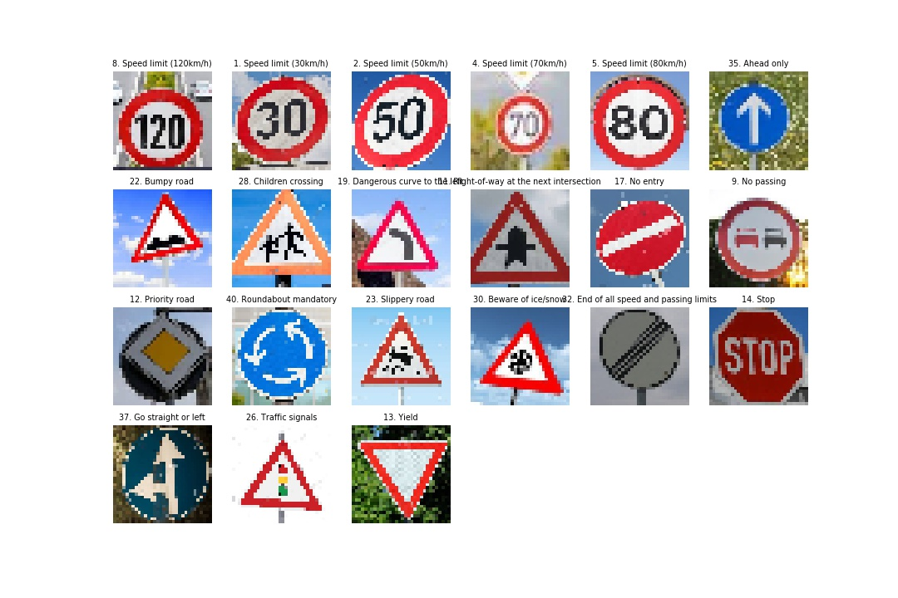

# **Traffic Sign Recognition** 

## Writeup

<!-- ### You can use this file as a template for your writeup if you want to submit it as a markdown file, but feel free to use some other method and submit a pdf if you prefer. -->

---

**Build a Traffic Sign Recognition Project**

The goals / steps of this project are the following:
* Load the data set (see below for links to the project data set)
* Explore, summarize and visualize the data set
* Explore different tools/practices to augment the original dataset.
* Design, train and test a model architecture
* Use the model to make predictions on new images
* Analyze the softmax probabilities of the new images
* Summarize the results with a written report

[//]: # (Image References)
[class_dist]: ./visualization/class_distribution.jpg "Train, validation, test distribution"
[lightness_diff]: ./visualization/variant_light.jpg "Difference in lightness among images in the same class"
## Rubric Points
### Here I will consider the [rubric points](https://review.udacity.com/#!/rubrics/481/view) individually and describe how I addressed each point in my implementation.  

---
### Writeup / README

#### 1. Provide a Writeup / README that includes all the rubric points and how you addressed each one. You can submit your writeup as markdown or pdf. You can use this template as a guide for writing the report. The submission includes the project code.

You're reading it! and here is a link to my [project code](https://github.com/hd-chuong/CarND-Traffic-Sign-Classifier-Project/blob/master/Traffic_Sign_Classifier.ipynb)

### Data Set Summary & Exploration

#### 1. Provide a basic summary of the data set. In the code, the analysis should be done using python, numpy and/or pandas methods rather than hardcoding results manually.

I used the pandas library to calculate summary statistics of the traffic signs data set:

* The size of training set is 34799.
* The size of the validation set is 4410.
* The size of test set is 12630.
* The shape of a traffic sign image is (32, 32, 3).
* The number of unique classes/labels in the data set is 43.

#### 2. Include an exploratory visualization of the dataset.

The bar charts below indicates the the data distributions among 43 sign classes. While the same pattern of distribution occurs for training, validation and testing sets, it is noted that the number of images are very different among some classes (some classes have as low as 200 images, while others have as high as 2000 images). This requires some data augmentation techniques to improve the uniformness of the dataset. 

![Class distribution][class_dist]

It is also noted that the lightness of images in the same class varies.

![Varied lightness][lightness_diff]

### Design and Test a Model Architecture

#### 1. Describe how you preprocessed the image data. What techniques were chosen and why did you choose these techniques? Consider including images showing the output of each preprocessing technique. Pre-processing refers to techniques such as converting to grayscale, normalization, etc. (OPTIONAL: As described in the "Stand Out Suggestions" part of the rubric, if you generated additional data for training, describe why you decided to generate additional data, how you generated the data, and provide example images of the additional data. Then describe the characteristics of the augmented training set like number of images in the set, number of images for each class, etc.)

<!-- As a first step, I decided to convert the images to grayscale because ...

Here is an example of a traffic sign image before and after grayscaling.

![alt text][image2]

As a last step, I normalized the image data because ...

I decided to generate additional data because ... 

To add more data to the the data set, I used the following techniques because ... 

Here is an example of an original image and an augmented image:

![alt text][image3]

The difference between the original data set and the augmented data set is the following ...  -->

Basic preprocessing workflow:

| Preprocessing steps   		|     Note	        					| 
|:-----------------------------:|:---------------------------------------------:| 
| Resize into 32x32 image       | This is only helpful when predicting with new images      |
| Apply the CLAHE filter        | Lightness varies in the same image class. This filter aims to redistribute the image lightness and reduce the difference between different classes.| 
| Grayscale the images     	    | Obtain the behavior by using numpy and produces the same output as cv2.cvtColor(). While grayscaling the data does not necessarily improve the accuracy of the model, this helps the training a little bit faster, as we already reduce the dimension of each image from 3 to 1.	|
| Normalize the images		    | Bring the pixel into the range [-0.5, 0.5] for faster convergence (when training) |

__Note:__ To increase the robustness of the model, more data is produced. Using `ImageDataGenerator` from `keras.preprocessing`, we apply data augmentation techniques into the existing data. This includes horizontal/vertical shift, rotation, zooming. We also want to make sure that the newly created dataset have uniform distribution across classes, so the number of images is 6000 per each class, and the total number of images will be 258000.

#### 2. Describe what your final model architecture looks like including model type, layers, layer sizes, connectivity, etc.) Consider including a diagram and/or table describing the final model.

Based on the network architecture described in [this paper](http://yann.lecun.com/exdb/publis/pdf/sermanet-ijcnn-11.pdf), my model was added an extra convolutional layer to slightly increase the pattern recognition further.

My final model consisted of the following layers:

| Layer         		|     Description	        					| 
|:---------------------:|:---------------------------------------------:| 
| Input         		| 32x32x1 gray image   							| 
| Convolution 3x3     	| 1x1 stride, valid padding, outputs 30x30x20 	|
| RELU					|												|
| Max pooling	      	| 2x2 stride, outputs 15x15x20				    |
| Convolution 3x3	    | 2x2 stride, outputs 13x13x40    		        |
| RELU                  |                                               |
| Max pooling           | 2x2 stride, outputs 7x7x40                    |
| Convolution 3x3       | 1x1 stride, outputs 5x5x100                   |
| RELU                  |                                               |
| *The dataflow is branched out into two from here*                     |
| Branch 1: convolution 3x3 | 1x1 stride, output 3x3x400				|
| RELU                  |                                               |
| Flatten               | 3600 neurons                                  |
| Branch 2: Flatten     | 2500 neurons                                  |
| Two branches are merged and neurons from each are concatenated.		|
| Dropout = 0.5			|												|
| Fully connected   	| Output 43 neurons								|

#### 3. Describe how you trained your model. The discussion can include the type of optimizer, the batch size, number of epochs and any hyperparameters such as learning rate.

To train the model, I used an Adam optimizer with learning rate 1e-3. Batch size is 100.
To get to the accuracy of 96%, I trained the model with around 80 epochs. Please note that this is not complete in a single run, instead, each time 20 epoches are run and the model is saved to the disk. This is more convenient as I could check and modify after each session.

#### 4. Describe the approach taken for finding a solution and getting the validation set accuracy to be at least 0.93. Include in the discussion the results on the training, validation and test sets and where in the code these were calculated. Your approach may have been an iterative process, in which case, outline the steps you took to get to the final solution and why you chose those steps. Perhaps your solution involved an already well known implementation or architecture. In this case, discuss why you think the architecture is suitable for the current problem.

My final model results were:
* training set accuracy of 99.69%.
* validation set accuracy of 98.03%. 
* test set accuracy of 96.69%.   

If an iterative approach was chosen:
* What was the first architecture that was tried and why was it chosen?

> **Answer:** The first architecture was the CNN used to classify only 5 traffic signs. It is comprised of 2 convolutional layers and 2 fully connected networks. This was first chosen in order to evaluate how well this model performed and create the baseline for our project.

* What were some problems with the initial architecture?

> **Answer:** The main problem is that the model was not big enough the learn sufficiently - after 10 epochs the training accuracy only approached 90%, which was still less than 93%. Also, no dropout layer was used, which might lead to overfitting.

* How was the architecture adjusted and why was it adjusted? 

> **Answer:** One extra convolution layer was added to increase the model capacities to learn on more complex patterns. The number of neurons are increased to improve the model capacity.

* Which parameters were tuned? How were they adjusted and why?

> **Answer:** Epochs: Up to 80 to make optimization runs more. Learning rate: 0.001. Smaller learning rate to prevent the model from diverging from the local maximum.

* What are some of the important design choices and why were they chosen? For example, why might a convolution layer work well with this problem? How might a dropout layer help with creating a successful model?

> **Answer**:
As the model capacity was not big enough (underfitting), I decided to choose the slightly different model. I used the model from [the paper](http://yann.lecun.com/exdb/publis/pdf/sermanet-ijcnn-11.pdf) and selected a large number of neurons from each layer. Before the diverging into two branches, I added an extra layer such that the model will learn more complex patterns.

I chose the 3x3 convolution filters instead of 5x5 filter and this increased the average accuracy a little further. This could be explained by the fact that the model could learn smaller subtle details that differentiate this class of signs from other.

To increase the robustness of the model, I added more training images and made the number of images for each class uniform. 

I also added a dropout layer (probability of 0.5 to keep neurons) right after fully connected neurons to force the neurons not to have the same behaviors with the others and prevent the model from overfitting.

<!-- If a well known architecture was chosen:
* What architecture was chosen?
* Why did you believe it would be relevant to the traffic sign application?
* How does the final model's accuracy on the training, validation and test set provide evidence that the model is working well? -->
 

### Test a Model on New Images

#### 1. Choose five German traffic signs found on the web and provide them in the report. For each image, discuss what quality or qualities might be difficult to classify.

Here are a variety of German traffic signs that I found on the web:

...

A few points should be discussed:
- Number signs are easily misclassified: 30 vs. 80, 70 vs. 20, 20 vs. 120, 80 vs end of speed limit 80.
- Some patterns are confusing: pedestrians vs. children crossing, pedestrians vs. right-of-way at next intersection.

#### 2. Discuss the model's predictions on these new traffic signs and compare the results to predicting on the test set. At a minimum, discuss what the predictions were, the accuracy on these new predictions, and compare the accuracy to the accuracy on the test set (OPTIONAL: Discuss the results in more detail as described in the "Stand Out Suggestions" part of the rubric).

Here are the results of the prediction:

| Image			        |     Prediction	        					| 
|:---------------------:|:---------------------------------------------:| 
| Speed limit 120 km/h      		| Speed limit 120 km/h   									| 
| Speed limit 30 km/h     			| Speed limit 30 km/h 										|
| Speed limit 50 km/h					| Speed limit 50 km/h											|
| Speed limit 70 km/h	      		| Speed limit 70 km/h					 				|
| Speed limit 80 km/h			| End of speed limit 80 km/h     							|
| Ahead only | Ahead only |
| Bumpy road | Bumpy road |
| Children crossing | children crossing |
| Dangerous Left | Dangerous Left|
| Right-of-way at the next intersection | Pedestrians |
| No entry | No entry |
| No passing | No passing |
| Priority road | Priority road |
| Roundabout mandatory | Roundabout mandatory |
| Slippery road | Slippery road |
| Be aware of snow | Be aware of snow |
| End of all speed and passing limits | End of all speed and passing limits |
| Stop | Stop |
| Go straight or left | Go straight or left |
| Traffic signals | Traffic signals |
| Yield | Yield |

The model was able to correctly guess 19/21 traffic signs, which gives an accuracy of 90.4%. This compares favorably to the accuracy on the test set of 96.69%.

#### 3. Describe how certain the model is when predicting on each of the five new images by looking at the softmax probabilities for each prediction. Provide the top 5 softmax probabilities for each image along with the sign type of each probability. (OPTIONAL: as described in the "Stand Out Suggestions" part of the rubric, visualizations can also be provided such as bar charts)

| Images         	|     Prediction 1	        					| Prediction 2| Prediction 3 | Prediction 4 | Prediction 5 |
|:---------------------:|:---------------------------------------------:|:------:|:------:|:--------:|:----------:|
| 120 km/h         		| 120 km/h (1.00),    					    | 20 km/h (0.00) | 70 km/h (0.0) | 100 km/h (0.0) | Roundabout (0.0) |
| 80 km/h     			| End of speed limit 80km/h (0.998) 		| 60 km/h (0.002) | 80 km/h (0.0) | No passing (0.0) | No vehicle over 3.5 tons (0.0)|
| Ahead only					| Ahead only (1.0)					| Straight or left (0.0) | Roundabout (0.0) | Right-of-way next intersection (0.0) | Straight or right (0.0) |
| Bumpy road	      			| Bumpy Road (1.0)					 				| No passing (0.0) | Bicycle passing (0.0) | End of no passing (0.0)| Priority road (0.0) |
| Priority road				    | Priority Road (1.0)      							| Roundabout (0.0) | No vehicles (0.0) | Go straight (0.0) | 50 km/h (0.0)|
